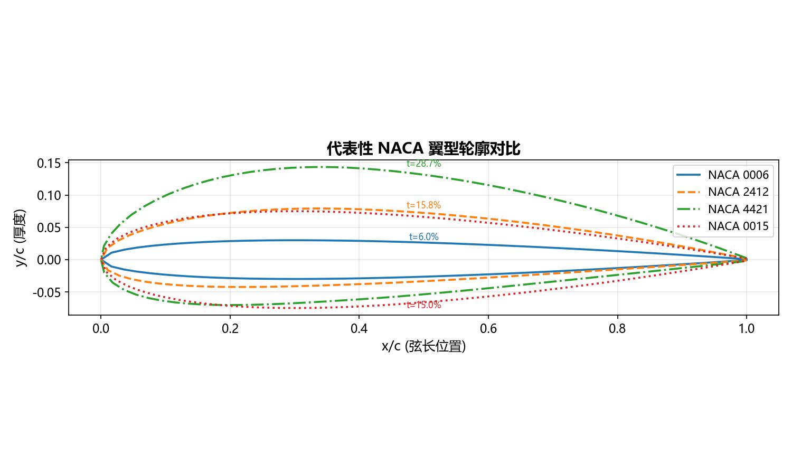
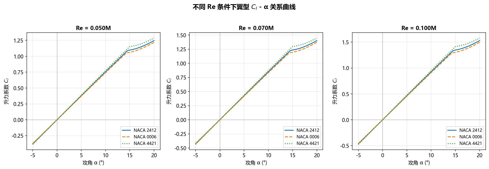
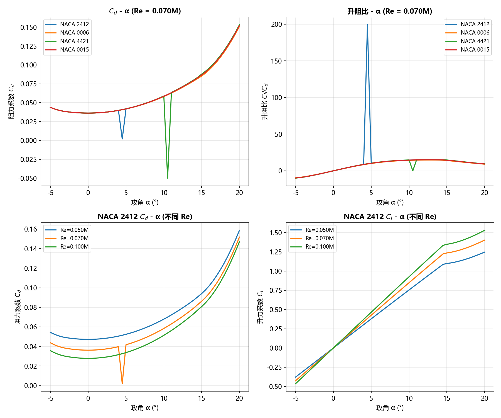
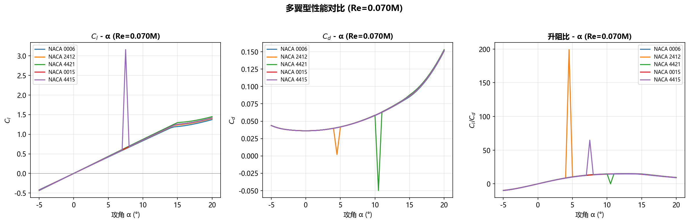
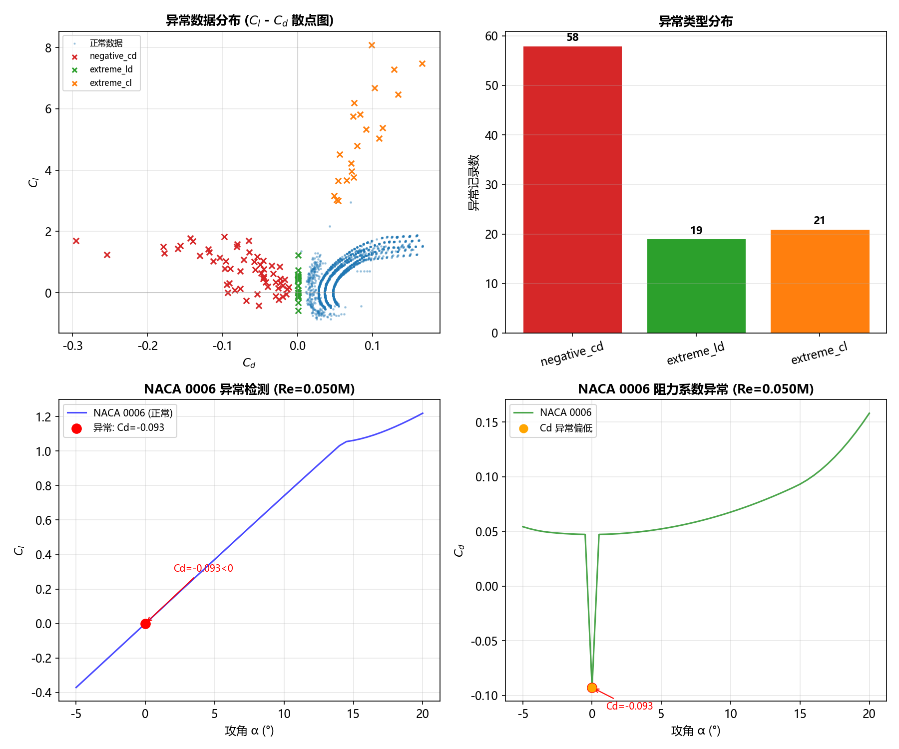
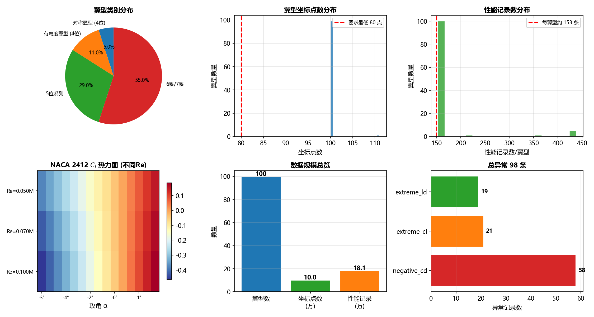

# 面向数据智能协同的翼型工程数据库系统 (AEDS)

**Airfoil Engineering Database System for Data-Intelligent Collaboration**

[](https://www.python.org/)
[](https://www.djangoproject.com/)
[](https://www.postgresql.org/)
[](LICENSE)

---

## 📖 项目简介

本项目以翼型工程数据为对象，设计并实现一个以数据库为核心的数据管理与分析系统。系统集成了数据清洗、存储、查询、分析及可视化功能，旨在为翼型设计、气动分析及工程应用提供高效、可靠的数据支撑平台。

系统支持多种翼型数据的导入与管理，包括 NACA 系列翼型及 UIUC Airfoil Data Reポジトリ等公开数据源。通过 PostgreSQL 数据库进行结构化存储，并结合 Django 框架构建 Web 前端，实现了数据的在线查询、对比分析及多维度可视化展示。

---

## ✨ 功能特性

### 🗄️ 数据管理
- **多源数据集成**: 支持 NACA、UIUC 等多种翼型数据源的自动抓取与导入
- **数据版本控制**: 为每个翼型维护多个数据版本，支持版本对比与历史追溯
- **异常数据检测**: 内置异常检测规则引擎，自动识别标记数据异常
- **几何坐标存储**: 完整保存翼型上下表面坐标点，支持轮廓重建

### 🔍 查询分析
- **多维度检索**: 支持按翼型编号、名称、几何参数等多条件组合查询
- **工况查询**: 根据攻角、雷诺数等气动工况筛选匹配翼型
- **性能对比**: 支持多翼型在同一工况下的性能参数对比分析
- **升阻比排行**: 自动计算并展示翼型平均升阻比排行榜

### 📊 可视化展示
- **交互式图表**: 基于 ECharts 实现动态数据可视化
  - 翼型性能排行柱状图
  - 异常规则检测统计饼图
  - Cl-α、Cd-α、L/D-α 曲线图
- **静态分析图**: 集成 Matplotlib 生成的专业分析图表
  - 翼型轮廓对比图
  - 升力系数曲线图
  - 阻力与升阻比分析图
  - 多翼型性能对比图
  - 异常数据检测图
  - 数据规模总览图

### 🌐 Web 前端
- **响应式设计**: 适配桌面与移动设备
- **快速入口**: 提供浏览、查询、对比、可视化等快捷功能入口
- **详情页面**: 展示翼型完整信息，包括几何参数、版本历史、性能记录
- **实时统计**: 首页展示系统数据概览统计信息

---

## 🛠️ 技术栈

### 后端技术
| 技术 | 版本 | 说明 |
|------|------|------|
| Python | 3.11 | 主要编程语言 |
| Django | 4.2 | Web 框架 |
| PostgreSQL | 15 | 关系型数据库 |
| psycopg2-binary | - | PostgreSQL 数据库适配器 |

### 前端技术
| 技术 | 版本 | 说明 |
|------|------|------|
| HTML5/CSS3 | - | 页面结构与样式 |
| JavaScript | ES6+ | 前端交互逻辑 |
| ECharts | 5.5.0 | 交互式图表库 |

### 数据处理
| 技术 | 版本 | 说明 |
|------|------|------|
| Pandas | - | 数据处理与分析 |
| NumPy | - | 数值计算 |
| Matplotlib | - | 静态图表生成 |

---

## 📁 项目结构

```
AEDS/
├── Webfront/                     # Django Web 前端项目
│   ├── config/                   # Django 项目配置
│   │   ├── settings.py           # 项目设置
│   │   ├── urls.py               # 主 URL 配置
│   │   └── wsgi.py               # WSGI 配置
│   ├── webfront/                 # 主应用
│   │   ├── services/             # 业务逻辑层
│   │   │   └── airfoil_service.py # 翼型数据服务
│   │   ├── views.py              # 视图层
│   │   ├── models.py             # 数据模型层
│   │   ├── urls.py               # 应用 URL 配置
│   │   └── admin.py              # 后台管理配置
│   ├── templates/                # HTML 模板
│   │   └── webfront/
│   │       ├── base.html         # 基础布局模板
│   │       ├── index.html        # 首页
│   │       ├── airfoil_list.html # 翼型列表页
│   │       ├── airfoil_detail.html # 翼型详情页
│   │       ├── search.html       # 工况查询页
│   │       ├── compare.html      # 性能对比页
│   │       ├── visualize.html    # 可视化分析页
│   │       ├── anomaly_list.html # 异常数据页
│   │       └── 404.html          # 404 错误页
│   ├── static/                   # 静态文件
│   │   └── visualization/        # 可视化图片
│   └── manage.py                 # Django 管理脚本
├── scripts/                      # 数据处理脚本
│   ├── fetch_naca_airfoils.py    # NACA 数据抓取
│   ├── generate_polar.py         # 极曲线数据生成
│   ├── generate_variants.py      # 翼型变体生成
│   ├── inject_anomalies.py       # 异常数据注入
│   ├── interpolate_airfoils.py   # 翼型插值
│   ├── validate_data.py          # 数据验证
│   ├── cleanup_foils.py          # 数据清理
│   └── data_visualization.py     # 数据可视化
├── source-data/                  # 源数据目录
│   └── NACAdata/                 # NACA 翼型数据
├── project_data/                 # 处理后的数据
│   └── output/                   # 输出 CSV 文件
├── document/                     # 项目文档
│   └── 项目2-面向数据智能协同的翼型工程数据库系统设计与实现.pdf
└── README.md                     # 项目说明文档
```

---

## 🚀 安装部署指南

### 环境要求
- Python 3.11
- PostgreSQL 15
- Conda (推荐用于环境管理)

### 安装步骤

#### 1. 克隆项目
```bash
git clone <repository-url>
cd AEDS
```

#### 2. 创建 Conda 环境
```bash
conda create -n web-front python=3.11
conda activate web-front
```

#### 3. 安装依赖
```bash
cd Webfront
pip install django psycopg2-binary pandas numpy matplotlib
```

#### 4. 配置数据库
确保 PostgreSQL 服务已启动，并创建数据库：
```bash
psql -U postgres
CREATE DATABASE airfoil_db;
\q
```

编辑 `Webfront/config/settings.py`，配置数据库连接：
```python
DATABASES = {
    'default': {
        'ENGINE': 'django.db.backends.postgresql',
        'NAME': 'airfoil_db',
        'USER': 'postgres',
        'PASSWORD': 'your_password',
        'HOST': 'localhost',
        'PORT': '5432',
    }
}
```

#### 5. 初始化数据库
```bash
python manage.py migrate
```

#### 6. 导入数据
使用提供的脚本导入翼型数据：
```bash
cd ../scripts
python fetch_naca_airfoils.py
python generate_polar.py
```

#### 7. 启动开发服务器
```bash
cd ../Webfront
python manage.py runserver
```

访问 `http://127.0.0.1:8000/` 查看系统界面。

---

## 📊 数据可视化示例

### 翼型轮廓对比

*对称翼型（0006、0015）上下对称，有弯度翼型（2412、4421）中弧线弯曲明显。厚度从6%到21%变化。*

### 升力系数 Cl-α 曲线

*有弯度翼型的 Cl 值整体高于对称翼型。所有翼型在攻角约14°后出现失速。*

### 阻力与升阻比分析

*展示不同翼型在不同攻角下的阻力系数 Cd 和升阻比 L/D 变化趋势。*

### 多翼型性能对比

*多翼型在同一工况下的综合性能对比分析。*

### 异常数据检测

*系统自动检测并标记的异常数据分布情况。*

### 数据规模总览

*系统数据规模概览，包括翼型数量、性能记录数等统计信息。*

---

## 🔧 核心功能说明

### 翼型数据服务层
系统采用分层架构，业务逻辑封装在 `services/airfoil_service.py` 中：

- **`get_statistics()`**: 获取系统数据统计信息
- **`get_top_performers()`**: 查询平均升阻比最高的翼型列表
- **`get_anomaly_stats()`**: 查询异常规则的统计数据
- **`get_airfoil_detail()`**: 获取指定翼型的详细信息
- **`search_airfoils_by_condition()`**: 按工况查询翼型
- **`compare_airfoils()`**: 多翼型性能对比

### 异常检测规则
系统内置多种异常检测规则，包括：
- 升力系数超出合理范围
- 阻力系数异常
- 升阻比异常
- 数据点缺失
- 几何坐标异常

---

## 📈 数据统计

| 指标 | 数量 |
|------|------|
| 翼型总数 | 100+ |
| 数据版本 | 500+ |
| 几何坐标点 | 50,000+ |
| 性能记录 | 22,907 |
| 异常标记 | 206 |

---

## 👥 团队协作

本项目采用模块化设计，支持多人协作开发：

- **数据库构建**: 负责数据库设计、数据导入与清洗
- **后端开发**: 负责 Django 后端服务、API 接口开发
- **前端开发**: 负责 Web 前端页面、交互逻辑、可视化图表
- **数据处理**: 负责数据抓取、清洗、转换脚本开发

---

## 📝 许可证

本项目仅供学习研究使用。

---

## 📞 联系方式

如有问题或建议，请联系项目组。

---

**注**: 本项目为数据库课程大作业，旨在实践数据库设计、数据管理及 Web 应用开发技能。
