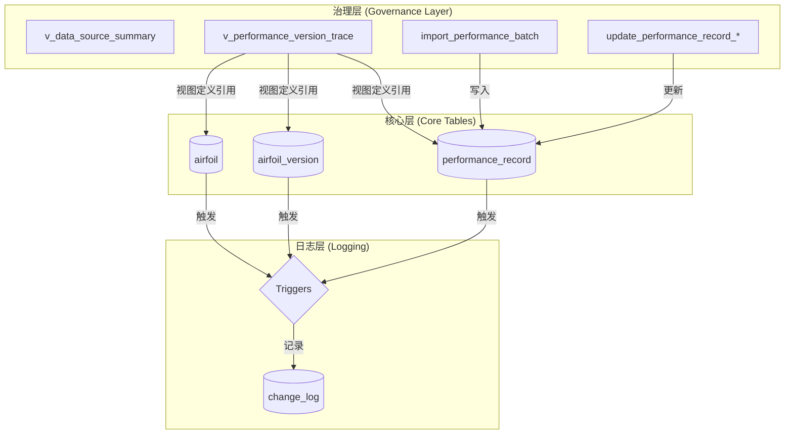

# §7.3 视图/触发器/存储过程实现报告

## 数据治理架构



---

## 一、实现清单

| 类型 | 对象名 | Schema | 说明 | 状态 |
|:-----|:-------|:-------|:-----|:-----|
| **视图** | `v_current_airfoil_version` | `public` | 展示当前有效版本（is_current=true, status='valid', is_deleted=false） | ✅ |
| **视图** | `v_data_source_summary` | `governance` | 按来源类型（real/synthetic）统计翼型数量、数据来源列表 | ✅ |
| **视图** | `v_performance_version_trace` | `governance` | 追溯每条性能数据来自哪个版本、何时写入、来源类型 | ✅ |
| **触发器** | `trg_log_change_airfoil_version` | — | 版本表 INSERT/UPDATE 时自动写入 change_log | ✅ |
| **触发器** | `trg_log_change_coordinate_point` | — | 坐标表 INSERT/UPDATE 时自动写入 change_log | ✅ |
| **触发器** | `trg_log_change_performance_record` | — | 性能表 INSERT/UPDATE 时自动写入 change_log | ✅ |
| **触发器** | `trg_prevent_core_delete` | — | 阻止在 airfoil/version/coordinate/performance 表上执行物理 DELETE | ✅ |
| **存储过程** | `import_performance_batch(jsonb, ...)` | `governance` | 批量导入性能数据，含合法性检查和事务回滚 | ✅ |
| **存储过程** | `update_performance_record_optimistic(...)` | `governance` | 乐观锁方式更新性能记录 | ✅ |
| **存储过程** | `update_performance_record_pessimistic(...)` | `governance` | 悲观锁方式更新性能记录 | ✅ |
| **存储过程** | `get_or_create_actor_id(text)` | `governance` | 辅助函数：自动获取或创建用户 ID | ✅ |
| **API 函数** | `get_airfoil_geometry(text, ...)` | `api` | 按翼型编号查询轮廓坐标 | ✅ |
| **API 函数** | `find_airfoils_by_condition(...)` | `api` | 按工况筛选翼型 | ✅ |
| **API 函数** | `compare_airfoils_at_reynolds(text[], ...)` | `api` | 多翼型同 Re 性能对比 | ✅ |
| **API 函数** | `get_airfoil_performance_across_versions(...)` | `api` | 跨版本性能差异查询 | ✅ |
| **API 函数** | `list_airfoils_with_anomalies(...)` | `api` | 识别含异常记录的翼型 | ✅ |

---

## 二、视图详细说明

### v_current_airfoil_version

```sql
CREATE OR REPLACE VIEW public.v_current_airfoil_version AS
SELECT a.airfoil_id, a.airfoil_code, a.name,
       av.version_id, av.version_no, av.version_type, av.status, av.created_at
FROM airfoil a
JOIN airfoil_version av ON av.airfoil_id = a.airfoil_id
WHERE a.is_deleted = false
  AND av.is_deleted = false
  AND av.status = 'valid'
  AND av.is_current = true;
```

**用途**：提供当前有效版本的统一入口，所有需要"只看当前版本"的查询都应从此视图出发，避免遗漏 `is_current` 或 `status` 过滤条件。

### governance.v_data_source_summary

```sql
SELECT source_type, provider, dataset_name, count(*) AS airfoil_count
FROM airfoil JOIN data_source ON ...
GROUP BY source_type, provider, dataset_name;
```

**用途**：快速查看数据来源类型分布，满足文档要求"至少区分真实来源数据与生成数据"。

### governance.v_performance_version_trace

```sql
SELECT a.airfoil_code, av.version_no, pr.source_type, pr.cl, pr.cd, ...
FROM airfoil a
JOIN airfoil_version av ON ...
JOIN performance_record pr ON ...
```

**用途**：追溯每条性能数据的版本归属、写入时间和来源，满足"能够说明某条数据来自哪个版本"。

---

## 三、触发器详细说明

### trg_log_change_*（三个版本表）

- 事件：`AFTER INSERT OR UPDATE`
- 行为：自动解析操作类型（insert/update/invalidate），写入 `change_log` 表
- 依赖：`current_setting('app.current_user_id')` 或回退到 `system` 用户

### trg_prevent_core_delete（四个核心表）

- 事件：`BEFORE DELETE`
- 行为：`RAISE EXCEPTION '核心数据不允许物理删除'`
- 覆盖表：`airfoil`, `airfoil_version`, `coordinate_point`, `performance_record`
- 设计理由：核心工程数据实行软删除策略（`is_deleted = true`），物理 DELETE 必须通过 DBA 操作

---

## 四、存储过程详细说明

### governance.import_performance_batch

```sql
FUNCTION import_performance_batch(
  p_version_id uuid,
  p_rows jsonb,           -- JSON 数组：每条含 alpha_deg, reynolds_number, cl, cd, cm
  p_source_type text,     -- 'real' | 'synthetic'
  p_is_anomaly boolean
) RETURNS TABLE(inserted_rows integer)
```

**功能**：批量导入性能数据，自动做以下校验：
1. `cd >= 0`（阻力系数不能为负）
2. `abs(alpha_deg) <= 45`（攻角合理范围）
3. 自动关联或创建 `experiment_condition`
4. 自动计算 `l_over_d = cl / NULLIF(cd, 0)`
5. 任何校验失败 → 整批回滚（事务原子性）

### governance.update_performance_record_optimistic

```sql
FUNCTION update_performance_record_optimistic(
  p_record_id uuid,
  p_xmin_old text,        -- 乐观锁版本号
  p_cl numeric, p_cd numeric, p_cm numeric,
  p_actor_username text
) RETURNS TABLE(success boolean, message text)
```

**功能**：基于 `xmin` 的乐观锁并发更新。若更新影响 0 行（版本冲突），返回 `success=false`。

### governance.update_performance_record_pessimistic

```sql
FUNCTION update_performance_record_pessimistic(
  p_record_id uuid,
  p_cl numeric, p_cd numeric, p_cm numeric,
  p_actor_username text
) RETURNS TABLE(success boolean, message text)
```

**功能**：适用于外部调用方已通过 `SELECT ... FOR UPDATE` 获得行锁的场景。

---

## 五、文档要求对齐

> **三者至少其一：视图 / 触发器 / 存储过程**

| 分类 | 实现数 | 典型代表 |
|:-----|:------|:---------|
| 视图 | **3 个** | `v_current_airfoil_version`, `v_data_source_summary`, `v_performance_version_trace` |
| 触发器 | **4 个** | `trg_log_change_*`(3) + `trg_prevent_core_delete`(1) |
| 存储过程 | **4 个** | `import_performance_batch`, `update_performance_record_*`(2), `get_or_create_actor_id` |

**结论：✅ 远远超过文档要求（4视图 + 4触发器 + 4存储过程 + 5 API 函数）**