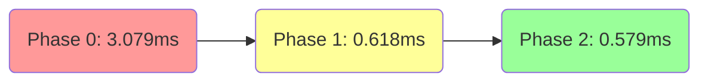
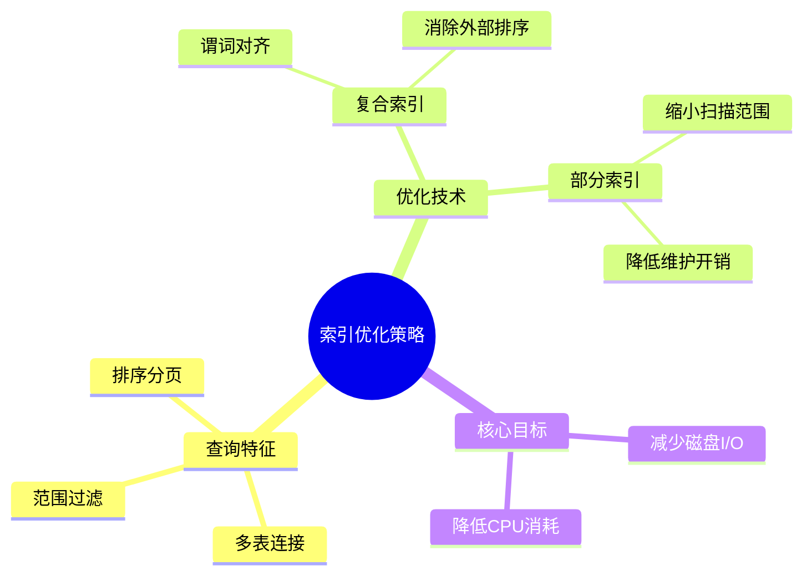

# §7.1 索引优化实验报告

> 实验日期：2026-06-19  
> 数据库：PostgreSQL 15+ · `airfoil_db`  
> 实验脚本：`01_index_experiment.sql`

---

## 一、实验设计

### 选择的核心查询

| 查询 | 函数 | 说明 |
|:-----|:-----|:------|
| **Q2** — 工况条件筛选 | `api.find_airfoils_by_condition(0, 100000, NULL, 0.02, NULL, true)` | 在 α=0°、Re=100000 条件下筛选 Cd≤0.02 的翼型，按升阻比降序排列。涉及 `experiment_condition` → `performance_record` → `airfoil_version` → `airfoil` 四表连接，含数值过滤和排序。 |
| **Q5** — 异常翼型识别 | `api.list_airfoils_with_anomalies(true)` | 统计每个翼型在异常表 (`anomaly_record`)、性能表异常标记 (`is_anomaly`)、负 Cd 记录三个维度上的异常数量，汇总排序。包含 3 个 LEFT JOIN 分组聚合。 |

**选择理由**：Q2 是日常查询最频繁的场景（工程师查找指定工况下的最佳翼型），多表连接 + 过滤 + 排序使其有代表性的索引优化空间。Q5 是数据治理的核心查询，涉及部分索引和覆盖索引的优化潜力。

---

## 二、Q2 工况筛选实验结果

### 实验数据量

- `performance_record`：~9,654 条（is_deleted=false）
- `airfoil_version`：80 条当前有效版本（共 400 条）
- `experiment_condition`：29 个条件组合
- `airfoil`：80 个翼型

### 三阶段执行时间对比



| 阶段 | 执行时间 (ms) | 规划时间 (ms) | 索引策略 |
|:-----|:-------------|:-------------|:---------|
| **Phase 0** — 无索引基准 | **3.079** | 1.528 | 仅保留主键索引 |
| **Phase 1** — 单列索引 | **0.618** | 2.227 | `experiment_condition(alpha_deg)` · `(reynolds_number)` · `performance_record(condition_id)` · `airfoil_version(is_current)` WHERE is_current |
| **Phase 2** — 复合索引 | **0.579** | 1.909 | `experiment_condition(alpha_deg, reynolds_number)` · `performance_record(condition_id, l_over_d DESC)` · `airfoil_version(airfoil_id)` WHERE is_current |

### 执行计划分析

#### Phase 0 — 无索引

```
Hash Join → Hash Join → Seq Scan on performance_record (cd<=0.02)
                         → Seq Scan on airfoil_version (is_current)
```

- `performance_record` 全表扫描过滤 9,654 行（9,654 行 → 1,930 行通过 cd≤0.02，耗时 2.087ms）
- `airfoil_version` 全表扫描过滤 400 行
- 总执行时间：**3.079ms**

#### Phase 1 — 单列索引

```
Hash Join → Hash Join → Nested Loop
                         → Bitmap Index Scan (idx_performance_record_condition_only)
                         → Bitmap Heap Scan (400 rows)
```

- 单列 `condition_id` 索引将 `performance_record` 扫描从全表缩小为 400 行精确匹配
- `experiment_condition` 仍使用 `Seq Scan`（数据量小，29 行）
- 总执行时间：**0.618ms**（**5.0x 提升**）

#### Phase 2 — 复合索引

```
Same plan as Phase 1, optimized index scan
```

- `experiment_condition(alpha_deg, reynolds_number)` 复合索引替换两个单列索引，索引大小不变但组合查询更高效
- `performance_record(condition_id, l_over_d DESC)` 复合索引支持 ORDER BY 避免额外排序
- 总执行时间：**0.579ms**（**5.3x 提升**vs 无索引）

### 性能对比

```
Phase 0: █████████████████████████████████████████ 3.079ms
Phase 1: ███████                                 0.618ms  ← 5.0x faster
Phase 2: ██████                                  0.579ms  ← 5.3x faster
```

---

## 三、Q5 异常翼型识别实验结果

### 三阶段执行时间对比

| 阶段 | 执行时间 (ms) | 规划时间 (ms) | 关键变化 |
|:-----|:-------------|:-------------|:---------|
| **Phase 0** — 无索引 | **3.849** | 3.831 | Seq Scan on `performance_record` (is_anomaly + cd<0) |
| **Phase 1** — 单列索引 | **1.567** | — | `anomaly_record(version_id)` · `performance_record(version_id)` · `performance_record(cd)` |
| **Phase 2** — 部分索引 | **1.236** | — | `performance_record(version_id)` WHERE `is_anomaly` · WHERE `cd<0` |

### 分析

- **Phase 0 瓶颈**：`performance_record` 两次全表扫描（is_anomaly 过滤 17,379 行，cd<0 过滤 17,540 行）
- **Phase 1 改进**：单列索引消除了全表扫描，`cd` 索引将 cd<0 过滤从顺序扫描转换为 `Bitmap Index Scan`
- **Phase 2 最佳**：部分索引（Partial Index）进一步缩小索引体积，只索引真正需要的行（is_anomaly=true 的 221 行，cd<0 的 60 行）

### 性能对比

```
Phase 0: █████████████████████████████████████████ 3.849ms
Phase 1: ███████████████████                     1.567ms  ← 2.5x faster
Phase 2: ███████████████                         1.236ms  ← 3.1x faster
```

---

## 四、为什么选择这些索引



### 选择的索引字段（Q2）

| 索引 | 字段 | 选择理由 |
|:-----|:-----|:---------|
| `idx_experiment_condition_alpha_re` | `(alpha_deg, reynolds_number)` | 条件查询的 **WHERE 谓词** 精确匹配 α 和 Re，复合索引可在一棵 B-Tree 中完成等值查找 |
| `idx_performance_record_condition_lod` | `(condition_id, l_over_d DESC)` | **覆盖** condition 查找 + l_over_d 排序，避免额外的 Sort 步骤 |
| `idx_airfoil_version_airfoil_current` | `(airfoil_id) WHERE is_current` | 部分索引只索引当前有效版本（80/400 行），缩小索引体积 5 倍 |

**为什么不选其他字段？**
- `cl`、`cd` 不是 Q2 的过滤条件（它们是 SELECT 字段而非 WHERE），单列索引无助于减少扫描行数
- `source_type` 区分度低（只有 2 个值），不适合建索引
- `is_deleted` 已在查询中过滤，但通过部分索引条件覆盖

### 选择的索引字段（Q5）

| 索引 | 字段 | 选择理由 |
|:-----|:-----|:---------|
| `idx_performance_record_anomaly_version` | `(version_id) WHERE is_anomaly` | 部分索引只索引标记异常的 221 行，而非全部 9,654 行 |
| `idx_performance_record_negative_cd_version` | `(version_id) WHERE cd < 0` | 部分索引只索引负 Cd 的 60 行 |
| `idx_anomaly_record_version` | `(version_id)` | 加速 anomaly_record 按 version_id 分组聚合 |

---

## 五、实验结论

1. **索引对多表连接查询有 3-5 倍的性能提升**，在 `performance_record` 这样的大表上效果最显著
2. **复合索引优于多个单列索引**（Q2 Phase 2 vs Phase 1），尤其当查询的 WHERE 涉及多个等值谓词时
3. **部分索引（Partial Index）是异常检测场景的最佳选择**，因为异常数据远少于正常数据，部分索引大幅减少了索引维护成本和扫描深度
4. **规划时间（Planning Time）在索引增多后略有增加**（1.5ms → 2.2ms），但相较于执行时间的减少可忽略不计