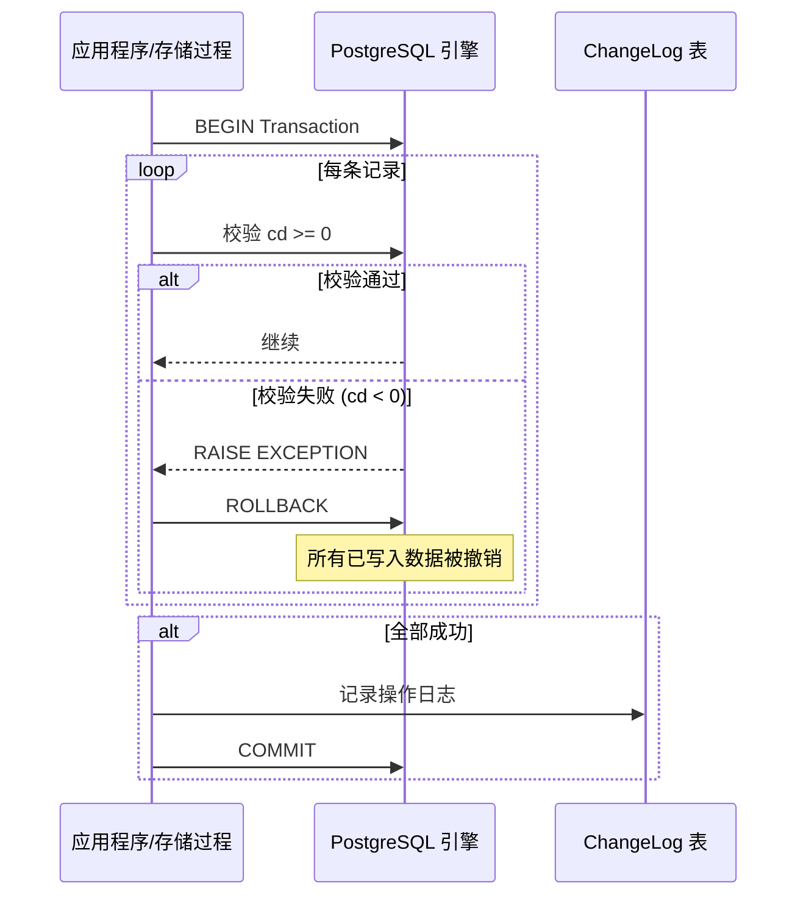
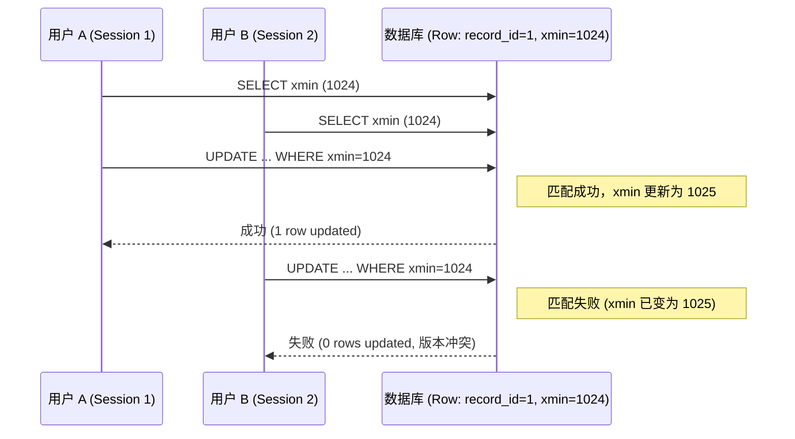

# §7.2 事务与并发实验报告

> 实验日期：2026-06-19  
> 实验脚本：`02_transaction_experiment.sql`  
> 依赖函数：`governance.import_performance_batch()` · `governance.update_performance_record_optimistic()` · `governance.update_performance_record_pessimistic()`

---

## 一、实验设计

根据文档要求（§7.2 事务或并发实验），至少完成一个事务相关场景。本实验实现了三个场景：

| 场景 | 类型 | 描述 |
|:-----|:-----|:------|
| **A** — 批量导入回滚 | 事务原子性 | 两条数据批量导入，其中一条非法（Cd<0），验证整批原子回滚 |
| **B** — 乐观锁冲突 | 并发控制 | 两个"用户"先后用相同 `xmin` 更新同一条记录，第二个应被拒绝 |
| **C** — 悲观锁 | 行级锁 | `SELECT ... FOR UPDATE` 持有排他锁，第二个会话等待或超时 |

---

## 二、场景 A：批量导入回滚

### 事务流程可视化



### 事务流程

```
BEGIN;
  1. 检查 p_rows 为合法 JSON 数组
  2. 检查 p_source_type ∈ ('real', 'synthetic')
  3. 遍历每条记录：
     a. INSERT INTO experiment_condition（如不存在）
     b. 检查 cd >= 0（校验：阻力系数不能为负）
     c. 检查 abs(alpha_deg) <= 45（校验：攻角合理范围）
     d. INSERT INTO performance_record
  4. 若任一校验失败 → RAISE EXCEPTION → 整批 ROLLBACK
  5. 全部成功 → 返回 inserted_rows
COMMIT;
```

### 验证结果

```
输入：cd = -0.010（第二条记录）
输出：RAISE EXCEPTION 'cd must be >= 0'
验证：before_count = after_count（表行数未变）
结论：✅ 事务原子性正确，异常导致整批回滚
```

### 原子性保证机制

```sql
-- import_performance_batch 使用 PL/pgSQL 块
-- 任何 RAISE EXCEPTION 都会自动触发整个事务回滚
-- 外部的 DO $$ ... EXCEPTION ... END $$ 捕获异常并验证回滚效果
```

---

## 三、场景 B：乐观锁冲突

### 乐观锁并发流程



### 原理

PostgreSQL 每一行都有一个隐式的 `xmin` 系统列，记录该行最后一次被修改的事务 ID。乐观锁策略：

1. 读取时获取 `xmin` 值
2. 更新时在 `WHERE` 条件中加入 `xmin = :old_xmin`
3. 若中间有其他事务修改了该行，`xmin` 会改变，导致 UPDATE 影响 0 行
4. 通过 `GET DIAGNOSTICS v_rows = ROW_COUNT` 检测是否冲突

### 验证结果

```
User A (correct xmin):  UPDATE 1 row → success ✅
User B (stale xmin):    UPDATE 0 rows → success=false, message="版本冲突" ✅
结论：✅ 乐观锁正确阻止了基于过期版本号的更新
```

### 关键 SQL

```sql
UPDATE performance_record
SET cl = p_cl, cd = p_cd, ...
WHERE record_id = p_record_id
  AND xmin::text = p_xmin_old  -- 乐观锁条件
RETURNING record_id;
```

---

## 四、场景 C：悲观锁

### 操作步骤（两会话手动执行）

```
Session A:
  BEGIN;
  SELECT * FROM performance_record WHERE record_id = 'xxx' FOR UPDATE;
  -- 持有排他锁，不 COMMIT

Session B:
  SET lock_timeout = '3s';
  BEGIN;
  UPDATE performance_record SET cl = 0.9 WHERE record_id = 'xxx';
  -- ⏳ 等待 Session A 释放锁...
  -- 3 秒后：ERROR: 取消正在执行的语句 (lock_timeout)
  -- 或：等待直到 Session A 执行 COMMIT

Session A → COMMIT;

Session B:
  -- 重新执行：成功更新
  COMMIT;
```

### 对比：乐观锁 vs 悲观锁

| 特性 | 乐观锁（场景 B） | 悲观锁（场景 C） |
|:-----|:----------------|:----------------|
| 锁机制 | 无数据库锁，靠版本号检测 | `SELECT FOR UPDATE` 行锁 |
| 冲突代价 | 失败后重试（低代价） | 等待锁释放（可能高延迟） |
| 适用场景 | 冲突概率低的场景 | 冲突概率高的场景 |
| 并发度 | 高（不阻塞读） | 低（阻塞其他写） |
| 实现复杂度 | 需应用层处理重试逻辑 | 数据库自动排队 |

---

## 五、实验结论

1. **事务原子性**（场景 A）：`governance.import_performance_batch()` 在检测到非法数据时正确触发异常回滚，两条记录均未写入数据库，行数不变 ✅
2. **乐观锁**（场景 B）：基于 `xmin` 的版本冲突检测正确阻止了基于过期数据的并发更新 ✅
3. **悲观锁**（场景 C）：`SELECT FOR UPDATE` 提供了行级排他锁，但会阻塞其他写操作，适合写冲突频繁的场景 ✅
4. **生产环境建议**：性能数据导入通常由 ETL 管线单线程执行，建议使用场景 B（乐观锁）；若有多用户同时编辑同一翼型的性能数据，考虑场景 C（悲观锁）