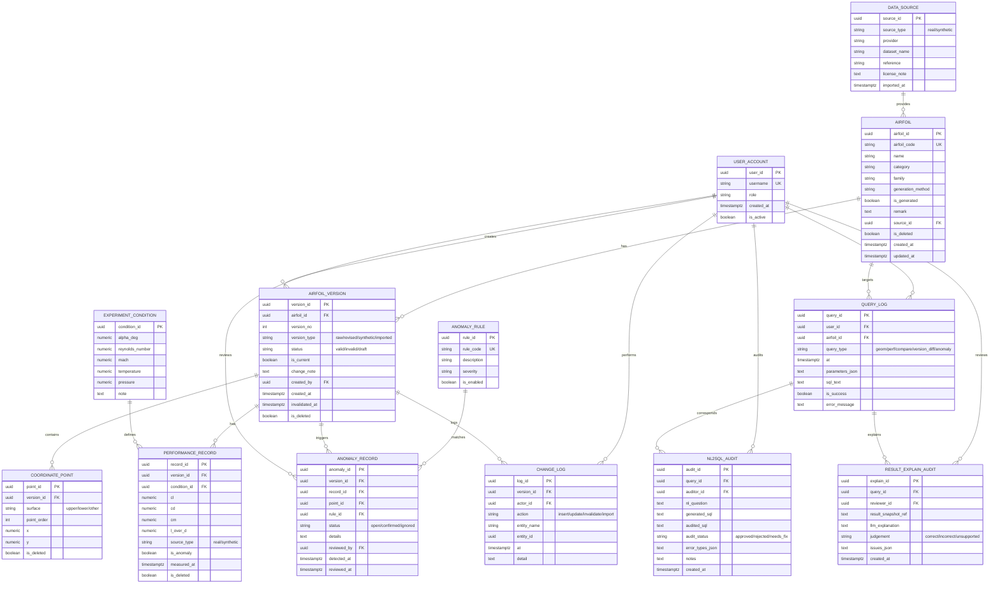

# 翼型工程数据库系统（PostgreSQL）数据库设计技术文档

## 1. 背景与目标

本数据库面向翼型工程数据管理与分析，围绕以下目标进行设计：

- 管理翼型基础信息、几何坐标、性能记录、数据版本、数据来源、用户等核心对象
- 用主键/外键/唯一/检查约束保障一致性与数据质量
- 支撑核心查询（按翼型取轮廓、按工况筛选翼型、同 Re 曲线对比、版本差异对比、异常识别）
- 体现数据治理能力：异常识别、版本追踪、来源说明、删除策略（核心数据以逻辑删除/失效为主）
- 支持后续索引优化实验、执行计划分析，以及至少一个事务/并发一致性实验

数据库选型：PostgreSQL。

## 2. 概念模型（ER 图）

本系统采用“显式版本表 + 业务数据引用版本”的版本管理方式：几何坐标点与性能记录均通过 `version_id` 关联到翼型版本，从而保证修订时新增版本而不是覆盖原记录。

说明：

- `AIRFOIL` 表示翼型实体；`AIRFOIL_VERSION` 表示翼型数据版本（几何/性能修订均通过新增版本实现）。
- `COORDINATE_POINT` 存储轮廓点；`surface` 区分上表面/下表面/其他，`point_order` 保证轮廓点序。
- `EXPERIMENT_CONDITION` 归一化工况；`PERFORMANCE_RECORD` 记录在某一工况下的性能指标。
- `DATA_SOURCE` 标注数据来源类型（真实/生成）与引用信息，满足“来源说明”要求。
- `ANOMALY_RULE` / `ANOMALY_RECORD` 承载异常规则与异常结果落表，满足“异常识别与治理”。
- `CHANGE_LOG` 支撑通过触发器自动记录变更日志（满足高级机制选项之一）。
- `QUERY_LOG` 支撑查询留痕与分析。
- `NL2SQL_AUDIT` / `RESULT_EXPLAIN_AUDIT` 用于“数据智能协同”留痕（若仅实现数据库设计需求，可视为扩展模块）。

## 3. 逻辑结构设计（表说明）

下述为逻辑设计层面的核心表与字段语义（字段名与类型可按实现微调，保持语义一致即可）。

### 3.1 AIRFOIL（翼型基础信息）

- 主键：`airfoil_id`
- 候选键：`airfoil_code`（翼型编号全局唯一）
- 外键：`source_id -> DATA_SOURCE(source_id)`
- 逻辑删除：`is_deleted`

用于满足“翼型名称、编号、类别、来源、生成方式、备注”等管理需求。

### 3.2 AIRFOIL\_VERSION（版本信息）

- 主键：`version_id`
- 外键：`airfoil_id -> AIRFOIL(airfoil_id)`，`created_by -> USER_ACCOUNT(user_id)`
- 关键字段：`version_no`（递增版本号）、`status`（valid/invalid/draft）、`is_current`（当前有效版本标识）
- 约束核心：同一翼型的版本号不能重复

用于满足“修订保留版本信息，不覆盖原始记录”，并支持“标记失效”操作（建议通过 `status`/`invalidated_at` 实现）。

### 3.3 COORDINATE\_POINT（几何坐标）

- 主键：`point_id`
- 外键：`version_id -> AIRFOIL_VERSION(version_id)`
- 关键字段：`surface`、`point_order`、`x`、`y`
- 建模原则：同一版本下同一 surface 的点序唯一，确保可重建轮廓

### 3.4 EXPERIMENT\_CONDITION（实验/工况）

- 主键：`condition_id`
- 关键字段：`alpha_deg`（攻角）、`reynolds_number`（雷诺数），可按数据来源补充 Mach、温度、压力等

将工况抽成独立实体，便于复用与索引，并降低 `PERFORMANCE_RECORD` 的重复字段。

### 3.5 PERFORMANCE\_RECORD（性能数据）

- 主键：`record_id`
- 外键：`version_id -> AIRFOIL_VERSION(version_id)`，`condition_id -> EXPERIMENT_CONDITION(condition_id)`
- 关键字段：`cl`、`cd`、`l_over_d` 等
- 约束核心：同一版本 + 同一工况不应重复插入

`source_type`/`is_anomaly` 用于与示例数据字段对齐，简化导入与规则检测落表。

### 3.6 DATA\_SOURCE（数据来源）

- 主键：`source_id`
- 关键字段：`source_type`（real/synthetic）、`provider`、`reference`

满足“区分真实来源数据与生成数据，并保留说明”要求。

### 3.7 USER\_ACCOUNT（用户）

用于记录操作人员，配合日志与审计需求。

### 3.8 ANOMALY\_RULE / ANOMALY\_RECORD（异常识别与落表）

- ANOMALY\_RULE：规则元数据（例如 Cd < 0、升阻比异常、相邻攻角变化不合理）
- ANOMALY\_RECORD：规则命中结果落表，可关联到性能点（`record_id`）或坐标点（`point_id`），并支持人工复核状态

### 3.9 CHANGE\_LOG（变更日志）

用于通过触发器记录关键表的变更事件，支撑版本追踪与治理审计。

### 3.10 QUERY\_LOG（查询日志）

用于记录关键查询、导出与分析行为，便于形成“查询语句 + 执行计划 + 性能对比”的实验材料。

### 3.11 扩展：NL2SQL\_AUDIT / RESULT\_EXPLAIN\_AUDIT（数据智能协同留痕）

若系统需要体现“自然语言到 SQL 的受控生成与审计”和“结果解释审计”，建议保留两张审计表以形成证据链：

- NL2SQL\_AUDIT：记录自然语言问题、模型生成 SQL、审计后 SQL、审核结论与错误类型归纳
- RESULT\_EXPLAIN\_AUDIT：记录查询结果快照引用、模型解释、人工判定与问题类型归纳

## 4. 主键、外键与规范化说明

### 4.1 主键/外键设计原则

- 所有核心实体采用 surrogate key（UUID）作为主键，便于多源导入与分布式数据融合
- 业务唯一性通过候选键（如 `airfoil_code`、`(airfoil_id, version_no)`、`(version_id, condition_id)`）来保证
- 外键用于保证引用完整性，并作为连接查询的稳定锚点

### 4.2 函数依赖与第三范式（3NF）

本设计总体满足 3NF：

- 工况维度（攻角、雷诺数等）从性能记录中分离到 `EXPERIMENT_CONDITION`，降低冗余与更新异常
- 版本维度从业务数据中分离到 `AIRFOIL_VERSION`，保证修订不覆盖并能追踪来源与时间

允许的“可解释冗余”（需在报告中说明原因）：

- `PERFORMANCE_RECORD.l_over_d` 可选择冗余存储（便于快速筛选与可视化），但需保证与 `cl/cd` 一致性策略（例如插入时计算或定期校验）
- `PERFORMANCE_RECORD.source_type` 可视为导入便捷字段；若严格归一化，可改为关联到来源表/批次表

## 5. 完整性约束设计（满足需求文档约束类型）

### 5.1 非空约束（示例）

- `AIRFOIL(airfoil_code, name)` 非空
- `AIRFOIL_VERSION(airfoil_id, version_no, status, created_at)` 非空
- `COORDINATE_POINT(version_id, surface, point_order, x, y)` 非空
- `EXPERIMENT_CONDITION(alpha_deg, reynolds_number)` 非空
- `PERFORMANCE_RECORD(version_id, condition_id, cl, cd)` 非空

### 5.2 唯一约束（核心）

- `AIRFOIL.airfoil_code` 唯一
- `AIRFOIL_VERSION(airfoil_id, version_no)` 唯一
- `COORDINATE_POINT(version_id, surface, point_order)` 唯一
- `PERFORMANCE_RECORD(version_id, condition_id)` 唯一

### 5.3 检查约束（CHECK）

建议约束（可按数据范围调整）：

- `PERFORMANCE_RECORD.cd >= 0`
- `EXPERIMENT_CONDITION.reynolds_number > 0`
- `EXPERIMENT_CONDITION.alpha_deg` 在合理范围（例如 `[-30, 30]` 或更贴近数据集的范围）
- `COORDINATE_POINT.surface` 取值域限定（upper/lower/other）
- `AIRFOIL_VERSION.status` 取值域限定（valid/invalid/draft）

## 6. 核心查询与索引设计建议（用于性能实验）

### 6.1 核心查询 1：给定翼型编号，查询全部几何坐标

查询路径：`AIRFOIL(airfoil_code) -> AIRFOIL_VERSION(is_current/status) -> COORDINATE_POINT(order)`

索引建议：

- `AIRFOIL(airfoil_code)` 唯一索引
- `AIRFOIL_VERSION(airfoil_id, is_current)` 或 `(airfoil_id, status, created_at desc)`（便于取当前有效版本）
- `COORDINATE_POINT(version_id, surface, point_order)` 复合索引（满足顺序读取）

### 6.2 核心查询 2：给定工况条件，查询满足性能阈值的翼型

查询路径：`EXPERIMENT_CONDITION(alpha_deg, reynolds_number) -> PERFORMANCE_RECORD(cl/cd/l_over_d) -> AIRFOIL_VERSION -> AIRFOIL`

索引建议：

- `EXPERIMENT_CONDITION(alpha_deg, reynolds_number)` 复合索引（或唯一约束 + 索引）
- `PERFORMANCE_RECORD(condition_id, l_over_d desc)` 或 `(condition_id, cd, cl)`（按筛选条件选择）
- 若常用“仅当前版本”：可在 `AIRFOIL_VERSION(is_current)` 上建索引并在查询中限定

### 6.3 核心查询 3：比较多个翼型在同一 Re 下的性能曲线

查询路径：按 `reynolds_number` 定位工况集合，再按 `alpha_deg` 排序取曲线点。

索引建议：

- `EXPERIMENT_CONDITION(reynolds_number, alpha_deg)`
- `PERFORMANCE_RECORD(version_id, condition_id)`（已满足唯一性与连接）

### 6.4 索引实验输出材料（按需求文档）

每个实验建议固定：

- 查询 SQL
- `EXPLAIN (ANALYZE, BUFFERS)` 输出文本或截图
- 无索引/单列索引/复合索引前后耗时对比
- 说明选择该索引的依据（与查询谓词、连接键、排序键对应）

## 7. 数据治理机制设计

### 7.1 异常规则检测与落表

- `cd < 0`（违背物理意义）
- `l_over_d` 偏离同翼型同 Re 的统计范围（例如超过均值 ± k\*标准差）
- 相邻攻角 `alpha_deg` 的 `cl` 或 `cd` 变化不合理（需要定义阈值或基于差分统计）

落表策略：

- 将检测到的异常写入 `ANOMALY_RECORD`，并可同步更新 `PERFORMANCE_RECORD.is_anomaly`
- 保留检测时间、规则、关联记录、状态（open/confirmed/ignored），支持后续复核

### 7.2 版本追踪

通过 `AIRFOIL_VERSION` 的时间字段与 `CHANGE_LOG` 的变更事件，实现：

- 可追踪某条数据归属的版本、创建时间、创建人
- 可追踪版本失效时间与原因（`invalidated_at` / `change_note`）

### 7.3 数据来源说明

- `DATA_SOURCE.source_type` 区分真实与生成数据
- `AIRFOIL.source_id` 绑定翼型主来源
- 对性能记录若存在混合来源，可使用 `PERFORMANCE_RECORD.source_type` 标记（或进一步扩展为“导入批次表”）

### 7.4 删除策略（物理删除 vs 逻辑删除）

建议：

- 核心工程数据（翼型、版本、坐标、性能）默认不物理删除，仅通过 `is_deleted` 或 `status=invalid` 进行逻辑删除/失效标记
- 非关键日志类数据（如 QUERY\_LOG）可按留存周期物理清理（需在系统说明中明确）

## 8. 高级机制与事务场景（满足需求文档）

### 8.1 视图（示例：当前有效版本）

建议创建视图 `v_current_airfoil_version`，统一暴露“当前有效版本”的 `airfoil_id -> version_id` 映射，便于查询与应用层使用。

### 8.2 触发器（示例：自动写入变更日志）

建议在 `AIRFOIL`、`AIRFOIL_VERSION`、`COORDINATE_POINT`、`PERFORMANCE_RECORD` 上建立触发器，将 INSERT/UPDATE/DELETE（或逻辑删除）事件写入 `CHANGE_LOG`，形成可审计链条。

### 8.3 存储过程（可选：批量导入与合法性检查）

可实现 `import_performance_batch(...)` 等过程，在同一事务内完成：

- 导入工况（不存在则插入）
- 导入性能记录
- 执行检查约束与额外合法性校验
- 若某条非法，整批回滚（对应需求文档推荐的事务场景之一）

### 8.4 事务/并发一致性实验建议

推荐事务场景：

- 批量导入性能数据时，若存在 `cd < 0` 或唯一性冲突，则整批回滚（验证原子性）

推荐并发场景：

- 两用户同时修改同一条性能记录：在应用层用“乐观锁（版本号/更新时间戳）”或在数据库层用 `SELECT ... FOR UPDATE` 展示一致性控制

## 9. 交付物清单（对应课程要求）

- ER 图/概念模型图（本文件第 2 节）
- 建表脚本（DDL：表/约束/索引）
- 核心查询 SQL（至少覆盖需求文档要求的两类以上）
- 索引优化实验材料（SQL + 执行计划 + 性能对比 + 选型理由）
- 事务/并发实验说明与复现步骤
- 数据治理说明（异常检测、版本追踪、来源说明、删除策略）

## 10. 高级机制与并发场景落地（补充）

### 10.1 已实现脚本

- 高级机制脚本：`数据库设计/sql/11_advanced_mechanisms.sql`
- 事务并发脚本：`数据库设计/sql/12_transaction_concurrency_scenarios.sql`

### 10.2 高级机制实现点

- 视图机制：`public.v_current_airfoil_version`
  - 统一提供“当前有效版本”映射，过滤 `airfoil.is_deleted=false`、`airfoil_version.status='valid'`、`is_current=true`
- 触发器机制：版本化核心表自动写入 `change_log`
  - 表：`airfoil_version`、`coordinate_point`、`performance_record`
  - 触发器：`trg_log_change_*`
  - 触发函数：`governance.log_change_for_versioned_tables()`
- 存储函数机制：批量导入 + 合法性校验
  - 函数：`governance.import_performance_batch(...)`
  - 依赖现有约束（`CHECK/UNIQUE/FK`），任一非法行会使本次调用失败并回滚

### 10.3 事务场景实现与验证

- 场景 A：批量导入中存在非法数据导致整批回滚
  - 脚本：`12_transaction_concurrency_scenarios.sql` 的 Scenario A
  - 非法条件：`cd < 0` 且 `is_anomaly=false`，触发 `ck_performance_record_cd_or_anomaly`
  - 验证方式：导入前后 `performance_record` 行数一致

### 10.4 并发一致性实现与验证

- 乐观并发控制（Optimistic Lock）
  - 函数：`governance.update_performance_record_optimistic(...)`
  - 冲突令牌：PostgreSQL 系统列 `xmin`
  - 行为：`WHERE xmin::text = p_expected_xmin`，若不匹配返回冲突信息
  - 脚本：`12_transaction_concurrency_scenarios.sql` 的 Scenario B（两次更新模拟陈旧写入）
- 悲观锁控制（Pessimistic Lock）
  - 函数：`governance.update_performance_record_pessimistic(...)`
  - 机制：先 `SELECT ... FOR UPDATE` 再更新
  - 脚本：`12_transaction_concurrency_scenarios.sql` 的 Scenario C（双会话步骤）
  - 建议：会话 B 设置 `lock_timeout` 验证阻塞/超时，再在会话 A 提交后重试

### 10.5 与约束条件的一致性

- 批量导入与并发更新均复用表级约束，不绕过数据规则：
  - `uq_performance_record_ver_cond`
  - `fk_performance_record_version` / `fk_performance_record_condition`
  - `ck_performance_record_cd_or_anomaly`
- 触发器写日志遵循 `change_log` 约束：
  - 动作域限制：`insert/update/invalidate/import`
  - `actor_id` 由 `governance.get_or_create_actor_id()` 保证可用
