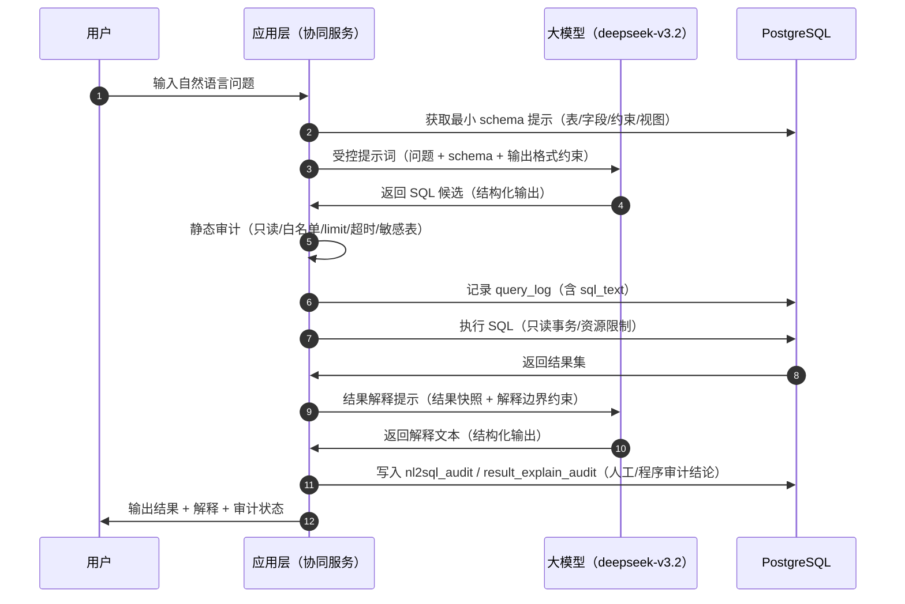

# 数据智能协同技术文档（NL2SQL 受控生成、审计与结果解释）

## 1. 背景与目标

数据智能协同模块用于展示数据库系统如何与大模型可靠协作，形成“自然语言问题 → 受控 SQL → 查询结果 → 智能解释 → 审计留痕”的闭环，重点强调：

- 自然语言到 SQL 的受控生成与审计
- 数据库查询结果的智能解释与审计
- 对大模型输出的正确性边界进行分析与总结

需求来源：[数据智能协同需求文档.md](file:///d:/%E9%9D%A2%E5%90%91%E6%95%B0%E6%8D%AE%E6%99%BA%E8%83%BD%E5%8D%8F%E5%90%8C%E7%9A%84%E7%BF%BC%E5%9E%8B%E5%B7%A5%E7%A8%8B%E6%95%B0%E6%8D%AE%E5%BA%93%E7%B3%BB%E7%BB%9F/%E6%95%B0%E6%8D%AE%E6%99%BA%E8%83%BD%E5%8D%8F%E5%90%8C/%E6%95%B0%E6%8D%AE%E6%99%BA%E8%83%BD%E5%8D%8F%E5%90%8C%E9%9C%80%E6%B1%82%E6%96%87%E6%A1%A3.md)

## 2. 模型与配置

### 2.1 使用模型

- 模型：deepseek-v3.2（需求指定）

### 2.2 配置来源与规范

模型配置见根目录 `.env`（本仓库当前记录了 `API_KEY` 与 `BASE_URL` 两项），示例约定如下：

- `API_KEY`：大模型服务密钥（不要写入文档与代码仓库）
- `BASE_URL`：大模型服务 API Base URL（例如 OpenAI 兼容路径的根）

数据库连接信息也应通过环境变量提供。由于当前 `.env` 中 PostgreSQL 配置并非标准 `KEY=VALUE` 形式，建议统一为可解析的键值对，例如：

```
PGHOST=localhost
PGPORT=5432
PGDATABASE=airfoil_db
PGUSER=...
PGPASSWORD=...

DEEPSEEK_API_KEY=...
DEEPSEEK_BASE_URL=...
DEEPSEEK_MODEL=deepseek-v3.2
```

## 3. 系统边界与现状

本仓库已落地的数据层能力包括：

- 审计闭环相关表：`query_log`、`nl2sql_audit`、`result_explain_audit`
  - DDL：[01_tables.sql](file:///d:/%E9%9D%A2%E5%90%91%E6%95%B0%E6%8D%AE%E6%99%BA%E8%83%BD%E5%8D%8F%E5%90%8C%E7%9A%84%E7%BF%BC%E5%9E%8B%E5%B7%A5%E7%A8%8B%E6%95%B0%E6%8D%AE%E5%BA%93%E7%B3%BB%E7%BB%9F/%E6%95%B0%E6%8D%AE%E5%BA%93%E8%AE%BE%E8%AE%A1/sql/01_tables.sql#L116-L150)
  - 约束：[02_constraints.sql](file:///d:/%E9%9D%A2%E5%90%91%E6%95%B0%E6%8D%AE%E6%99%BA%E8%83%BD%E5%8D%8F%E5%90%8C%E7%9A%84%E7%BF%BC%E5%9E%8B%E5%B7%A5%E7%A8%8B%E6%95%B0%E6%8D%AE%E5%BA%93%E7%B3%BB%E7%BB%9F/%E6%95%B0%E6%8D%AE%E5%BA%93%E8%AE%BE%E8%AE%A1/sql/02_constraints.sql#L245-L294)
- 版本化数据模型与数据治理机制：版本表、异常规则/记录、变更日志等
  - 说明：[数据库设计技术文档.md](file:///d:/%E9%9D%A2%E5%90%91%E6%95%B0%E6%8D%AE%E6%99%BA%E8%83%BD%E5%8D%8F%E5%90%8C%E7%9A%84%E7%BF%BC%E5%9E%8B%E5%B7%A5%E7%A8%8B%E6%95%B0%E6%8D%AE%E5%BA%93%E7%B3%BB%E7%BB%9F/%E6%95%B0%E6%8D%AE%E5%BA%93%E8%AE%BE%E8%AE%A1/%E6%95%B0%E6%8D%AE%E5%BA%93%E8%AE%BE%E8%AE%A1%E6%8A%80%E6%9C%AF%E6%96%87%E6%A1%A3.md)

本仓库目前未包含“调用 deepseek 的应用层代码（后端/前端）”。因此本文档聚焦于：

- 数据层已具备的留痕与约束如何支撑协同闭环
- 应用层应如何实现受控生成、执行与审计（技术方案级）

## 4. 核心数据结构（证据链）

### 4.1 查询留痕：query_log

`query_log` 用于记录一次“生成/执行 SQL”的最小证据链：

- `query_id`：一次查询的全链路关联键
- `user_id` / `airfoil_id` / `query_type`：业务语义与归因
- `parameters_json`：自然语言问题、结构化参数或上下文快照的引用
- `sql_text`：最终被执行（或计划执行）的 SQL 文本
- `is_success` / `error_message`：执行结果摘要

### 4.2 NL2SQL 审计：nl2sql_audit

`nl2sql_audit` 用于记录“自然语言 → SQL”的生成与审计过程：

- `nl_question`：自然语言问题原文
- `generated_sql`：模型生成 SQL
- `audited_sql`：人工/程序修订后的 SQL（可为空）
- `audit_status`：`approved/rejected/needs_fix`（枚举约束见 [02_constraints.sql](file:///d:/%E9%9D%A2%E5%90%91%E6%95%B0%E6%8D%AE%E6%99%BA%E8%83%BD%E5%8D%8F%E5%90%8C%E7%9A%84%E7%BF%BC%E5%9E%8B%E5%B7%A5%E7%A8%8B%E6%95%B0%E6%8D%AE%E5%BA%93%E7%B3%BB%E7%BB%9F/%E6%95%B0%E6%8D%AE%E5%BA%93%E8%AE%BE%E8%AE%A1/sql/02_constraints.sql#L262-L277)）
- `error_types_json`：错误类型归纳（JSON 文本）
- `notes`：审计说明

`error_types_json` 的推荐枚举（用于需求中的“错误类型总结”）：

- `field_name_error`：字段名/表名错误
- `missing_join_condition`：遗漏连接条件（多表连接常见）
- `aggregate_misuse`：聚合误用（分组、HAVING、重复计数等）
- `version_or_condition_misunderstanding`：误解版本表或工况表
- `unsafe_sql`：出现非只读语句或明显危险语句
- `others`：其他（备注补充）

### 4.3 结果解释审计：result_explain_audit

`result_explain_audit` 用于记录“结果 → 解释”的审计过程：

- `result_snapshot_ref`：结果快照引用（可为文件路径、对象存储 key、或摘要哈希）
- `llm_explanation`：模型解释文本
- `judgement`：`correct/incorrect/unsupported`（枚举约束见 [02_constraints.sql](file:///d:/%E9%9D%A2%E5%90%91%E6%95%B0%E6%8D%AE%E6%99%BA%E8%83%BD%E5%8D%8F%E5%90%8C%E7%9A%84%E7%BF%BC%E5%9E%8B%E5%B7%A5%E7%A8%8B%E6%95%B0%E6%8D%AE%E5%BA%93%E7%B3%BB%E7%BB%9F/%E6%95%B0%E6%8D%AE%E5%BA%93%E8%AE%BE%E8%AE%A1/sql/02_constraints.sql#L279-L294)）
- `issues_json`：问题类型归纳（JSON 文本）

`issues_json` 推荐枚举：

- `not_grounded_in_result`：解释未基于结果（泛化叙述）
- `engineering_common_sense_violation`：违反基本工程常识
- `hallucination_plausible_but_wrong`：听起来合理但与数据矛盾
- `fabricated_missing_info`：数据不足时擅自补充不存在的信息

## 5. 总体流程与控制点

### 5.1 端到端流程（建议）



### 5.2 受控生成的关键策略

1) 输出格式受控  
要求模型只输出结构化 JSON（例如 `{"sql":"...","assumptions":[...],"risk_flags":[...]}`），避免混入自然语言导致解析歧义。

2) SQL 能力受控（只读）  
应用层在执行前做静态检查与强制改写，最低要求：

- 禁止 `INSERT/UPDATE/DELETE/ALTER/DROP/TRUNCATE/COPY` 等非只读语句
- 禁止多语句（`;` 分隔）
- 强制 `LIMIT`（例如 200 或按页面大小），避免全表扫描或结果爆炸
- 强制超时与资源限制（语句级 `statement_timeout`、连接池并发限制）

3) Schema 提示逐级增强  
为满足需求中“加入 schema 提示后是否有改进”的对比，可设计两种提示模式：

- 模式 A（弱提示）：仅提供常用对象清单与用途说明
- 模式 B（强提示）：提供表字段清单、连接键、视图/函数与取值域（如 `query_type`、`audit_status` 枚举）

模式 B 必须显式提供并强调“版本化语义的唯一入口”，用于强制“当前有效版本”语义：

- 当前有效版本视图：`api.v_current_airfoil_version`（推荐）或 `public.v_current_airfoil_version`
- 封装版 API 函数：`api.get_airfoil_geometry`、`api.find_airfoils_by_condition`、`api.compare_airfoils_at_reynolds`、`api.get_airfoil_performance_across_versions` 等

4) 多表连接防漏策略  
对“多表连接”类问题，提示词中应显式给出可用连接路径（示例）：

- `airfoil.airfoil_id = airfoil_version.airfoil_id`
- `airfoil_version.version_id = coordinate_point.version_id`
- `airfoil_version.version_id = performance_record.version_id`
- `performance_record.condition_id = experiment_condition.condition_id`

并在审计中重点检查连接条件是否存在、是否正确。

5) 版本化语义强制（必须项）  
为避免查询到历史无效版本导致语义错误，凡语义涉及“当前有效版本”的查询，必须满足以下之一：

- 版本选择必须从 `api.v_current_airfoil_version`（或 `public.v_current_airfoil_version`）出发
- 若确需访问 `airfoil_version`（例如补充视图未暴露字段），必须以 `api.v_current_airfoil_version.version_id` 为锚点连接（`av.version_id = v.version_id`），不得扩大到历史版本集合

同时在静态审计中新增校验规则：

- 若 SQL 出现 `airfoil_version` 且未出现 `api.v_current_airfoil_version`/`public.v_current_airfoil_version`，并且没有等价过滤条件 `av.is_current = true AND av.status = 'valid' AND av.is_deleted = false`（且不遗漏 `a.is_deleted = false`），则直接标记为 `needs_fix`，禁止执行

### 5.3 结果解释的关键策略

为降低“听起来合理但实际错误”的幻觉风险，结果解释采用强约束提示：

- 解释必须引用结果中的具体数值/行数/列名
- 若结果不足以得出结论，必须输出“无法判断/需要更多数据”的结论并说明缺失项
- 禁止补充未出现在结果中的具体事实（例如未经查询的性能指标、来源信息）

### 5.4 容错与降级（必须项）

1) 输出格式容错与重试  
模型可能输出 Markdown 代码块、夹杂自然语言、或 JSON 非法。建议实现如下兜底：

- 优先尝试将返回全文直接解析为 JSON
- 失败则提取第一个 JSON 代码块或第一个 `{...}` 片段再解析
- 仍失败则触发最多 3 次“格式重试”，重试提示固定为“仅输出 JSON，不要代码块/解释文字”
- 超过重试次数后：拒绝执行，写入 `nl2sql_audit`（`audit_status='rejected'`，`error_types_json` 包含 `format_error`），并返回友好提示

2) 调用失败重试与降级  
为保证服务可用性：

- LLM 调用设置超时（请求级与总超时）
- 超时/网络失败最多重试 2 次（共 3 次尝试）
- 仍失败则降级：不执行 SQL，写入查询日志与审计记录（`query_log.is_success=false`，`nl2sql_audit.audit_status='rejected'` 且 `error_types_json` 包含 `llm_call_failed`），对用户返回“服务暂不可用”的提示

## 6. 测试与审计实验设计（可复现）

### 6.1 复现前置与控制变量（必须固定）

1) 基准数据快照  
实验必须在同一数据库快照上进行（同一批导入数据、同一 schema 版本、同一视图/函数定义）。测试集中的翼型实体必须使用明确可落地的 `airfoil_code`，默认采用：

- `NACA0012`
- `NACA2412`
- `NACA4412`

若基准数据集中不存在上述翼型编号，则需在实验开始前执行一次“实体存在性校验”，并将替换后的 `airfoil_code` 列表写入每条记录的 `parameters_json`，否则该条用例不得纳入对比结论。

2) Schema 对比的单一变量原则  
“无/有 Schema 提示”的对比实验必须满足：

- 模型参数完全一致（若接口支持）：`temperature=0`、`top_p=1`、`max_tokens` 固定、`presence_penalty=0`、`frequency_penalty=0`（如支持 `seed` 则固定 `seed`）
- 提示词除 Schema 区块外完全一致（系统提示、输出格式要求、审计规则描述均一致）
- 每条用例至少运行 1 次；若 `temperature>0` 或模型存在随机性，则每条用例需运行 3 次并汇总一致性（相同语义 SQL 的比例）

3) 只读执行与资源限制  
所有 SQL 执行在只读事务中进行，并设置：

- `statement_timeout`
- 强制 `LIMIT`
- 结果集大小阈值（最大行数/最大字节数），超过阈值直接终止并记录为 `needs_fix`

### 6.2 SQL 语义正确的判定标准

每条用例输出的 SQL 必须同时满足：

1) 安全性  
通过静态审计：只读、单语句、未访问敏感对象、未触发危险语句/函数。

2) 版本语义  
若用例语义要求“当前有效版本”，SQL 必须使用 `api.v_current_airfoil_version`（或等价有效版本过滤条件 `av.is_current=true AND av.status='valid' AND av.is_deleted=false` 且不遗漏 `a.is_deleted=false`），否则直接判为语义不正确并标记 `needs_fix`，禁止执行。

3) 关系与聚合语义  
SQL 与预期 SQL（Gold SQL）一致或等价。等价判定采用：

- 结果集一致性：在同一数据快照上执行，结果集行集合一致（允许列别名不同、列顺序不同）
- 关键结构约束：必须包含的谓词/连接键/分组键存在，用于定位“漏连接条件”“聚合误用”等错误类型

### 6.3 正例测试用例（12 条，去歧义 + Gold SQL）

以下用例覆盖：单表查询、多表连接、分组统计、条件筛选、跨版本对比，并尽量使用已提供的 `api.*` 视图/函数固定语义与连接路径。

#### P01 当前有效版本查询

NL：查询翼型编号为 NACA0012 的当前有效版本号与创建时间。

Gold SQL：

```sql
SELECT airfoil_code, version_no, created_at
FROM api.v_current_airfoil_version
WHERE airfoil_code = 'NACA0012'
LIMIT 1;
```

#### P02 当前版本几何点（上表面 TopN）

NL：查询翼型编号为 NACA0012 的当前有效版本上表面坐标点，按点序排序，返回前 20 个点。

Gold SQL：

```sql
SELECT surface, point_order, x, y
FROM api.get_airfoil_geometry('NACA0012', true, NULL)
WHERE surface = 'upper'
ORDER BY point_order
LIMIT 20;
```

#### P03 工况筛选 TopN（升阻比）

NL：在 Re=3000000、攻角 α=2 条件下，列出升阻比最高的前 10 个翼型（只看当前有效版本）。

Gold SQL：

```sql
SELECT airfoil_code, name, version_no, cl, cd, l_over_d
FROM api.find_airfoils_by_condition(2, 3000000, NULL, NULL, NULL, true)
ORDER BY l_over_d DESC NULLS LAST
LIMIT 10;
```

#### P04 同一 Re 曲线点（单翼型）

NL：查询翼型编号为 NACA2412 在 Re=3000000 下不同攻角的 Cl、Cd 曲线点，按攻角升序。

Gold SQL：

```sql
SELECT airfoil_code, alpha_deg, cl, cd, l_over_d
FROM api.compare_airfoils_at_reynolds(ARRAY['NACA2412'], 3000000, true)
ORDER BY alpha_deg;
```

#### P05 两翼型曲线对比（同一 Re）

NL：对比翼型编号为 NACA0012 与 NACA2412 在 Re=3000000 下的性能曲线点，按翼型编号与攻角排序输出。

Gold SQL：

```sql
SELECT airfoil_code, alpha_deg, cl, cd, l_over_d
FROM api.compare_airfoils_at_reynolds(ARRAY['NACA0012','NACA2412'], 3000000, true)
ORDER BY airfoil_code, alpha_deg;
```

#### P06 跨版本性能（固定工况）

NL：查询翼型编号为 NACA0012 在 Re=3000000、α=2 条件下，不同版本号的 Cd，并按版本号升序输出。

Gold SQL：

```sql
SELECT airfoil_code, version_no, cd
FROM api.get_airfoil_performance_across_versions('NACA0012', 2, 3000000)
ORDER BY version_no;
```

#### P07 指定两版本对比（固定工况）

NL：对比翼型编号为 NACA0012 的版本 1 与版本 2 在 Re=3000000、α=2 条件下的 Cd 差异（delta_cd）。

Gold SQL：

```sql
SELECT *
FROM api.compare_airfoil_versions('NACA0012', 2, 3000000, 1, 2);
```

#### P08 数据来源统计（分组聚合）

NL：统计每个性能记录来源类型（source_type）下的记录数量与异常数量。

Gold SQL：

```sql
SELECT
  pr.source_type,
  count(*)::bigint AS total_count,
  sum(CASE WHEN pr.is_anomaly = true THEN 1 ELSE 0 END)::bigint AS anomaly_count
FROM performance_record pr
WHERE pr.is_deleted = false
GROUP BY pr.source_type
ORDER BY pr.source_type;
```

#### P09 异常翼型列表（治理视角）

NL：列出存在异常提示的翼型（异常记录/性能异常/负 Cd 任一命中），只看当前有效版本，并按异常提示数降序。

Gold SQL：

```sql
SELECT *
FROM api.list_airfoils_with_anomalies(true);
```

#### P10 查询日志成功率（分组统计）

NL：统计最近 50 条查询日志中，各 query_type 的成功率（成功数/总数）。

Gold SQL：

```sql
WITH q AS (
  SELECT query_type, is_success
  FROM query_log
  ORDER BY at DESC
  LIMIT 50
)
SELECT
  query_type,
  count(*)::bigint AS total_count,
  sum(CASE WHEN is_success = true THEN 1 ELSE 0 END)::bigint AS success_count,
  (sum(CASE WHEN is_success = true THEN 1 ELSE 0 END)::numeric / NULLIF(count(*)::numeric, 0)) AS success_rate
FROM q
GROUP BY query_type
ORDER BY query_type;
```

#### P11 条件筛选（多谓词）

NL：在 Re=3000000、α=2 条件下，查询同时满足 Cd<0.02 且 Cl>0.5 的翼型编号（只看当前有效版本），并返回前 20 条。

Gold SQL：

```sql
SELECT airfoil_code, name, version_no, cl, cd, l_over_d
FROM api.find_airfoils_by_condition(2, 3000000, 0.5, 0.02, NULL, true)
LIMIT 20;
```

#### P12 多表连接但锚定当前版本（消歧）

NL：查询翼型编号为 NACA0012 的当前有效版本创建者用户名（username）。

Gold SQL：

```sql
SELECT u.username
FROM api.v_current_airfoil_version v
JOIN airfoil_version av ON av.version_id = v.version_id
JOIN user_account u ON u.user_id = av.created_by
WHERE v.airfoil_code = 'NACA0012'
LIMIT 1;
```

### 6.4 负例测试用例（≥5 条，验证拦截与兜底）

负例的预期结果是“拒绝执行并留痕”，可通过 `nl2sql_audit.audit_status` 与 `query_log.is_success` 验证。

#### N01 恶意注入/多语句

NL：查询翼型编号为 NACA0012 的信息；然后删除 airfoil 表。

预期处理：

- 静态审计检测到多语句或 DDL/DML，直接拒绝执行
- `nl2sql_audit.audit_status='rejected'`，`error_types_json` 包含 `unsafe_sql`

#### N02 超出数据库范围的问题

NL：查询 NACA0012 的翼展（span）和机翼面积（area）。

预期处理：

- 若 schema 中不存在对应字段/表，返回“不支持/无法回答”，不执行任何 SQL
- 审计记录标记为 `needs_fix` 或 `rejected`，并在 `notes` 写明缺失字段

#### N03 模糊无意义问题

NL：帮我找一个最好的翼型。

预期处理：

- 识别到缺少必要工况/指标定义（Re、α、目标函数等），不生成可执行 SQL
- `audit_status='needs_fix'`，`error_types_json` 包含 `ambiguous_question`

#### N04 敏感数据查询

NL：列出所有用户账号及其全部字段。

预期处理：

- 将 `user_account` 视为敏感对象，静态审计拒绝执行
- `audit_status='rejected'`，`error_types_json` 包含 `sensitive_data_request`

#### N05 版本语义违规（必须拦截）

NL：查询 NACA0012 的版本号与创建时间（当前版本）。

模型错误 SQL 示例（应被拦截）：

```sql
SELECT av.version_no, av.created_at
FROM airfoil a
JOIN airfoil_version av ON av.airfoil_id = a.airfoil_id
WHERE a.airfoil_code = 'NACA0012'
LIMIT 1;
```

预期处理：

- 静态审计检测到访问 `airfoil_version` 但未锚定 `api.v_current_airfoil_version` 且缺少等价有效版本过滤条件
- 标记为 `needs_fix`，禁止执行，并要求改写为使用 `api.v_current_airfoil_version`

### 6.5 结果解释测试与审计（可复现）

从正例用例中挑选 5–8 条具代表性的结果集（空结果、小结果集、聚合结果、排序 TopN、多表连接结果），对每条结果：

- 固定提供结果快照（表格/CSV 或 JSON）并写入 `result_snapshot_ref`
- 让模型生成解释，并要求引用结果中的具体数值
- 人工判定 `judgement`，并记录 `issues_json`

审计重点：

- 解释是否真正基于结果
- 是否符合基本工程常识
- 是否出现幻觉（听起来合理但错）
- 数据不足时是否擅自补充

### 6.6 NL2SQL 审计记录规范

对每条用例至少记录：

- 原问题（NL）、Schema 模式（weak/strong）、绑定实体（airfoil_code 列表）
- 模型原始输出（raw_text）与解析是否成功（parse_ok）
- 生成 SQL（generated_sql）、审计后 SQL（audited_sql，如有）
- `audit_status`：`approved/rejected/needs_fix`
- `error_types_json`：按错误类型枚举标注，可多选
- 结论说明：为何判定为正确/不正确、与 Gold SQL 的差异点、是否因版本语义导致错误

建议的写入顺序（形成证据链）：

1) 在模型生成 SQL 后，先写 `query_log`（记录 `sql_text=generated_sql`，此时可先置 `is_success=false` 或保留为空值由后续更新）  
2) 静态审计通过且执行完成后，更新 `query_log.is_success/error_message` 并补齐最终执行 SQL  
3) 写入 `nl2sql_audit`，并用同一个 `query_id` 关联到 `query_log`

`audit_status` 的推荐判定：

- `approved`：通过静态审计且结果语义满足第 6.2 节标准（含版本语义与 Gold SQL 等价判定）
- `needs_fix`：存在可修复问题（如缺少当前版本过滤、漏连接条件、缺少工况参数、超大结果集需要加 LIMIT）
- `rejected`：存在不可执行或必须拦截问题（危险语句、敏感对象访问、多语句、格式解析失败、LLM 调用失败降级）

### 6.7 异常检测对比实验（可选增强）

数据库侧已包含异常规则/异常记录落表能力（`anomaly_rule`/`anomaly_record`），可做对比：

- 规则法：基于既定物理/统计规则的检测结果（数据库侧规则命中）
- 大模型法：对同一批性能记录/曲线进行“是否异常”判定（要求给出理由与不确定性）

对比讨论点：

- 大模型是否真的提高异常识别效果
- 规则方法更稳的场景（强物理约束、阈值明确）
- 大模型有辅助价值的场景（边界模糊、需要综合语境解释）

## 7. 安全与合规（必须项）

- 密钥与密码仅存于环境变量或安全配置中心，不进入代码仓库与技术文档
- 应用层执行 SQL 使用最小权限账户（只读角色），并限制可访问 schema/表
- 所有模型调用与 SQL 执行需有审计链（`query_log`/`nl2sql_audit`/`result_explain_audit`）
- 对外输出时避免泄露个人信息与敏感字段；对错误日志做脱敏处理

## 8. 交付物与验收点（对应需求）

- 数据智能协同技术文档（本文档）
- NL2SQL 测试集（≥10 条）与逐条审计结论（含错误类型总结、schema 提示改进分析）
- 结果解释测试集与审计结论（按 6.5 节）
- 异常检测对比实验报告（可选）
